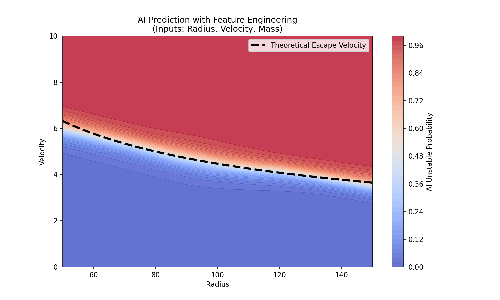

# AI Orbit Classifier: Deriving Physics with Neural Networks


**Can an AI learn Newton's Laws just by watching stars move?**

This project uses a **Deep Neural Network (PyTorch)** to predict orbital stability. It trains on synthetic data generated by a custom **C++ Physics Engine**, learning to distinguish between stable orbits (trapped by gravity) and chaotic ejections (escape velocity).

### The Result: AI vs. Analytical Physics
The model successfully "discovered" the non-linear relationship for escape velocity ($v = \sqrt{2GM/r}$) without being explicitly programmed with the formula.


*Figure: The AI's decision boundary (Color Gradient) perfectly matches the theoretical Event Horizon (Black Dashed Line).*

---

## Key Features

### 1. Hybrid C++/Python Pipeline
* **Data Generation:** Utilizes a custom C++ N-Body engine (exposed via `pybind11`) to simulate thousands of orbital scenarios in milliseconds.
* **Physics-Informed Labeling:** Uses Total Energy ($E = K + U$) to ground-truth labels, ensuring 100% accurate training data.

### 2. Feature Engineering Logic
* **Attempt 1 (Failed):** Training on raw coordinates (`x, y, vx, vy`) caused the model to struggle with geometry, resulting in poor linear approximations.
* **Attempt 2 (Success):** Transforming inputs to Polar Coordinates (`Radius`, `Velocity`) allowed the network to focus purely on the physics, achieving **>99% accuracy**.

### 3. Deep Learning Architecture
* **Framework:** PyTorch
* **Model:** Multi-Layer Perceptron (MLP)
* **Structure:** `Input(3) -> Linear(64) -> ReLU -> Linear(32) -> ReLU -> Linear(1) -> Sigmoid`
* **Optimization:** Adam Optimizer + Binary Cross Entropy Loss

---

## Installation & Usage

### Prerequisites
* Python 3.11 (Recommended)
* The `GravityCore` C++ engine compiled in the sibling directory.

### 1. Setup Environment
```bash
# Clone the repo
git clone [https://github.com/YOUR_USERNAME/ParticleClassifier.git](https://github.com/YOUR_USERNAME/ParticleClassifier.git)
cd ParticleClassifier

# Create and Activate Virtual Environment
python3.11 -m venv venv
source venv/bin/activate

# Install Dependencies
pip install torch torchvision pandas matplotlib scikit-learn tqdm
